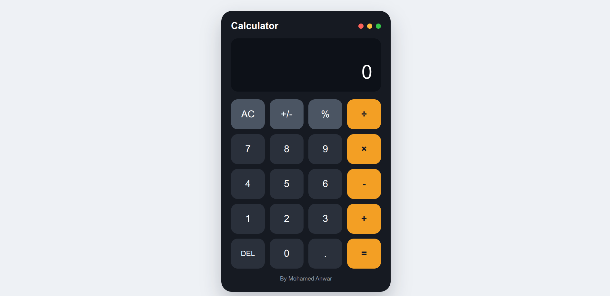

# React Calculator

A simple and responsive calculator built with React and Vite. It supports the main arithmetic operations with a clean interface that works well on desktop and mobile screens.

> **DEPI Front-End Development Task**  
> This repository contains a practical assignment completed as part of the **Digital Egypt Pioneers Initiative (DEPI)** Front-End Development training track. It documents hands-on progress through the program and is intended as a learning/task submission rather than a production product.

## Preview



## Features

- Addition, subtraction, multiplication and division
- Percentage calculation
- Positive and negative numbers
- Decimal numbers
- Delete last digit
- Clear calculator
- Responsive design

## Built With

- React
- Vite
- JavaScript
- CSS

## Live Demo

https://react-calculator-task-mhmdwaelanwrs-projects.vercel.app

## Run Locally

```bash
npm install
npm run dev
```

## Build

```bash
npm run build
```

---

**Training:** Digital Egypt Pioneers Initiative (DEPI) — Front-End Development Track  
**Author:** [Mohamed Anwar](https://github.com/mhmdwaelanwr)
